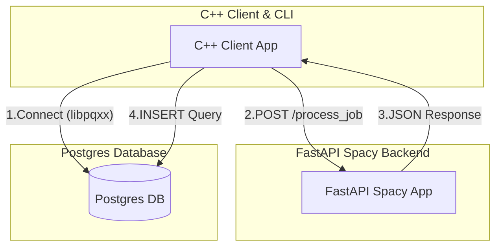

# JobTracker-CPP 💼


In effort to leverage modern C++20 features and understand how to build
REST API's with Boost. I have opted to replicate my 
[JobTracker](https://github.com/luisdavidgarcia/JobTracker) application in
C++20, which is a locally hosted containerized Job Application management tool 
for you to track your job applications in a Postgres Database instead of a 
spreadsheet.

I will be leveraging CMake for our build system, Docker for housing
our PostgreSQL container and Ollama, and Clang for formatting and linting
our project.

## Getting Started

### Prerequisites

1.First and foremost install `Docker` on your system. Follow Docker's [instructions](https://docs.docker.com/engine/install/)

2.  Create a `.env` file in the project root with the following variables:

```sh
POSTGRES_USER=your_username
POSTGRES_PASSWORD=your_password
POSTGRES_DB=your_database_name
DB_HOST=localhost
DB_PORT=5432
DATABASE_URL="postgresql://${POSTGRES_USER}:${POSTGRES_PASSWORD}@${DB_HOST}:${DB_PORT}/${POSTGRES_DB}"
```

### Running

To run JobTracker in Linux/MacOS run the following commands in your terminal:

```sh
# Get the production enviroment running
make start-prod

# Type the following to start the app:
./build/Jobtracker

# When you are done and type 'n' to end the app, then type "exit":
exit

# Clean up when you are done
make clean-prod
```

## Structure

### System Architecture



1. Internally C++ Client of JobTracker establishes a connection with the
   Database and FastAPI backend
2. Obtain the pasted Job Application from C++ Command Line Component and
   submit post request to FastAPI backend to process it
3. Retrieve the process Job Application as JSON in the C++ Client
4. Submit the JSON Job Application into the Database

### Directory and File Structure

```
.
├── CMakeLists.txt
├── compose.yaml
├── Dockerfile.cpp-dev-env
├── Dockerfile.cpp-dev-env.dockerignore
├── Dockerfile.cpp-prod
├── Dockerfile.cpp-prod.dockerignore
├── Dockerfile.spacy-ner
├── Dockerfile.spacy-ner.dockerignore
├── include
│   ├── app
│   │   └── JobTracker.hpp
│   ├── data
│   │   └── JobApplication.hpp
│   ├── db
│   │   └── PostgresDatabaseManager.hpp
│   └── llm
│       └── FastAPIClient.hpp
├── init.sql
├── logo.jpeg
├── Makefile
├── README.md
├── requirements.txt
├── src
│   ├── cpp
│   │   ├── app
│   │   │   └── JobTracker.cpp
│   │   ├── data
│   │   │   └── JobApplication.cpp
│   │   ├── db
│   │   │   └── PostgresDatabaseManager.cpp
│   │   ├── llm
│   │   │   └── FastAPIClient.cpp
│   │   └── main.cpp
│   └── python
│       ├── main.py
│       └── nlp_utils.py
└── tests
    └── cpp
        ├── CMakeLists.txt
        └── pasteJobDescription_test.cpp
```

#### Core Files Explained Simply

1. `src/cpp/app/JobTracker.cpp`: This is the main program which contains the 
    core logic for accepting pasted Job Applications, requesting the FastAPI 
    backend to process it with Spacy, and saving the returned parsed JSON data 
    to the Postgres database.
2. `src/cpp/data/JobApplication.cpp`: Contains the data structure that 
    encapsulates a Job Application with fields specified in `init.sql`
3. `src/cpp/db/PostgresDatabaseManager.cpp`: Contains the libpqxx interface and 
    logic to submit parsed, JSON applications to the database
4. `src/cpp/llm/FastAPIClient.cpp`: Serves as the backbone for creating POST 
    requests to the FastAPI backend to process raw plain text Job Application
6. `src/python/main.py`: Creates the FastAPI backend which accepts POST 
    requests and processes them into formatted JSON Job Application objects 
    with the Natural Language Processing (NLP) utility `JobProcessor`
7. `src/python/nlp_utils.py`: Homes the `JobProcessor` class that executes the 
    parsing logic to parse the raw plain text Job Application into a JSON format   

## Resources

1. [Boost Unit Testing](https://www.boost.org/doc/libs/latest/libs/test/doc/html/index.html)
2. [spaCy](https://spacy.io/)
3. [FastAPI](https://github.com/fastapi/fastapi)
4. [libpqxx](https://github.com/jtv/libpqxx)
5. [Docker Networking](https://www.netmaker.io/resources/docker-compose-network)
6. [Boost Json Conversions](https://www.boost.org/doc/libs/latest/libs/json/doc/html/json/conversion/custom_conversions.html)
7. [Boost Json Overloads](https://www.boost.org/doc/libs/latest/libs/json/doc/html/json/conversion/custom_conversions.html)
8. [Boost Json](https://www.boost.org/doc/libs/latest/libs/json/doc/html/index.html)
9. [Boost Beast](https://www.boost.org/doc/libs/latest/libs/beast/doc/html/index.html)
10. [Boost Asio](https://www.boost.org/doc/libs/1_73_0/doc/html/boost_asio/overview.html)
