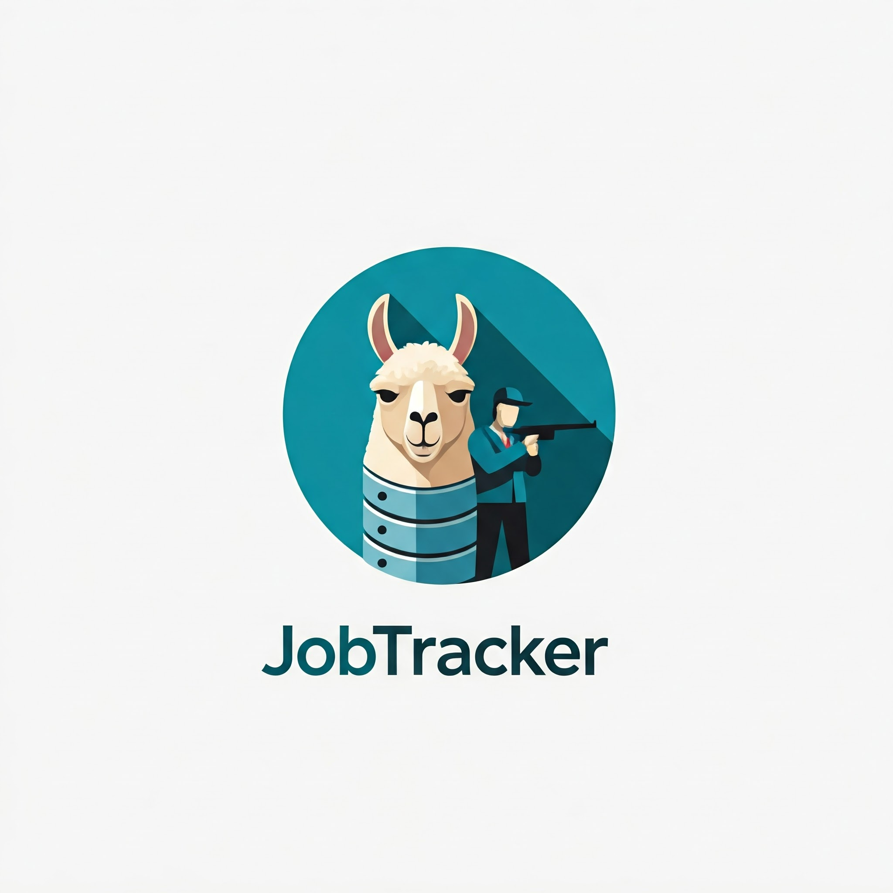
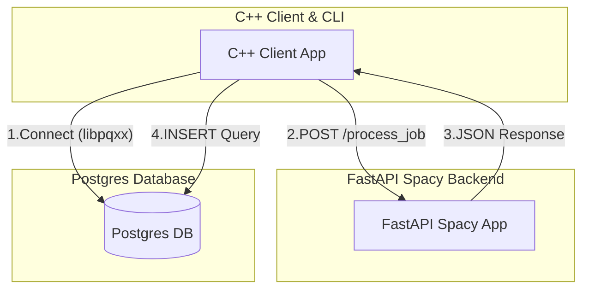

# JobTracker-CPP



In effort to leverage modern C++20 features and understand how to build
REST API's with Boost. I have opted to replicate my 
[JobTracker](https://github.com/luisdavidgarcia/JobTracker) application in
C++20. 

I will be leveraging CMake for our build system, Docker for housing
our PostgreSQL container and Ollama, and Clang for formatting and linting
our project.

## Getting Started

### Prerequisites

- Docker
- Docker Compose
- Within these containers the following software will be included:
  - C++20
  - PostgreSQL
  - Python 3.11+
    - fastapi
    - spacy
    - uvicorn
  - libpqxx
  - clang
  - cmake
  - boost-devel
  - libpq-devel
  - gdb
  - valgrind

To run JobTracker in Linux/MacOS run the following commands in your terminal:

```sh
docker compose up -d \
# To ensure none of the containers have "Exited"
docker compose ps -a \

# Permits us to run the C++ Env in a Bash Shell
docker exec -it cpp_dev_env /bin/bash \

mkdir build \
cd build \
cmake .. \
cmake --build . \

./JobTracker

# Turn off and clean up all of the containers
docker compose down
```

## Structure

### System Architecture



### Directory and File Structure

```
.
├── CMakeLists.txt
├── compose.yaml
├── Dockerfile.cpp-dev-env
├── Dockerfile.spacy-ner
├── include
│   ├── app
│   │   └── JobTracker.hpp
│   ├── data
│   │   └── JobApplication.hpp
│   ├── db
│   │   └── PostgresDatabaseManager.hpp
│   ├── llm
│   │   └── FastAPIClient.hpp
│   └── utils
│       └── EnvironmentConfig.hpp
├── init.sql
├── README.md
├── requirements.txt
├── src
│   ├── cpp
│   │   ├── app
│   │   │   └── JobTracker.cpp
│   │   ├── data
│   │   │   └── JobApplication.cpp
│   │   ├── db
│   │   │   └── PostgresDatabaseManager.cpp
│   │   ├── llm
│   │   │   └── FastAPIClient.cpp
│   │   ├── main.cpp
│   │   └── utils
│   │       └── EnviromentConfig.cpp
│   └── python
│       ├── main.py
│       └── nlp_utils.py
└── tests
    ├── CMakeLists.txt
    └── pasteJobDescription_test.cpp
```


## Resources

1. [Boost Unit Testing](https://www.boost.org/doc/libs/latest/libs/test/doc/html/index.html)
2. [spaCy](https://spacy.io/)
3. [FastAPI](https://github.com/fastapi/fastapi)
4. [libpqxx](https://github.com/jtv/libpqxx)
5. [Docker Networking](https://www.netmaker.io/resources/docker-compose-network)
6. [Boost Json Conversions](https://www.boost.org/doc/libs/latest/libs/json/doc/html/json/conversion/custom_conversions.html)
7. [Boost Json Overloads](https://www.boost.org/doc/libs/latest/libs/json/doc/html/json/conversion/custom_conversions.html)
8. [Boost Json](https://www.boost.org/doc/libs/latest/libs/json/doc/html/index.html)
9. [Boost Beast](https://www.boost.org/doc/libs/latest/libs/beast/doc/html/index.html)
10. [Boost Asio](https://www.boost.org/doc/libs/1_73_0/doc/html/boost_asio/overview.html)
